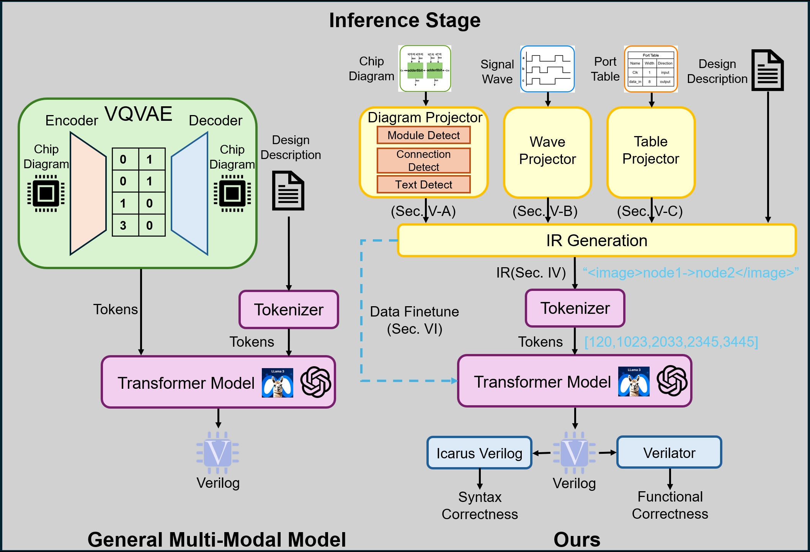

# Natural language is not enough: Benchmarking multi-modal generative AI for Verilog generation


## Benchmark
benchmark folder contains 3 kinds of design, arithmetic circuit, digital circuit, and advanced circuit repectively. Each design class folder several designs, and each design contains 3 level design descriptions: simple (simple_design_description.txt), medium (medium_design description.txt), and detailed (design_description.txt) respectively. In addition, each design folder contains the image of the design ([design_name].png), next token prediction prompts ([model_name]\_next_token_[idx].txt), the reference design code (reference.v), the testbench code (testbench.v). Overall, each design folder contains the following files.

- [design_name].png (design image)
- reference.v (reference Verilog code of design)
- testbench.v (testbench code of design)
- design_description.txt (default/complex design description for multi-modal models)
- medium_design_description.txt (medium design description for multi-modal models)
- simple_design_description.txt (simple design description for multi-modal models)
- gpt4_design_description.txt (default/complex design description for natural language only models)
- gpt4_medium_design_description.txt (medium design description for natural language only models)
- gpt4_simple_design_description.txt (simple design description for natural language only models)
- gptv_next_token_1.txt (first prompt of token prediction for multi-modal models)
- gptv_next_token_2.txt (second prompt of token prediction for multi-modal models)
- gptv_next_token_1.txt (third prompt of token prediction for multi-modal models)
- gpt4_next_token_1.txt (first prompt of token prediction for natural language only models)
- gpt4_next_token_2.txt (second prompt of token prediction for natural language only models)
- gpt4_next_token_1.txt (third prompt of token prediction for natural language only models)

- code_completion_1.txt (first prompt of code completion for multi-modal models)
- code_completion_2.txt (second prompt of code completion for multi-modal models)
- code_completion_3.txt (third prompt of code completion for multi-modal models)
- gpt4_code_completion_1.txt (first prompt of code completion for natural language only models)
- gpt4_code_completion_2.txt (second prompt of code completion for natural language only models)
- gpt4_code_completion_3.txt (third prompt of code completion for natural language only models)

## Enviroment establishment
1. Establish the python environment
```
pip install requirements.txt
```
2. You need to install `iverilog` package from [here](https://bleyer.org/icarus/) to establish the testing environment.
3. Use your own openai api keys in `benchmark_exp/llm_generate_code.py`, `src/llm_complete_code.py`, `benchmark_exp/llm_predict_token.py`. We recommend you use 2 api keys here to overcome the api limitations. 

## How to run the code
When you want to run the code, you can simply run
```
python benchmark_exp/main.py --model_name=<model> --prompt_type=<type> --method=<method>
```
args:
- model_name: gpt-4/gpt-4-vision-preview
- prompt_type: simple/medium/complex, three levels of the design_descriptions
- method: default/complete/predict, "default" means generate the whole verilog code, "complete" means complete the code with a snippet of the  verilog code, "predict" means predict the next token of the verilog code.

When you want to check the function correctness of the code, just run
```
python benchmark_exp/function_correctness.py
```

When you want to check the next token correctness, just run

```
python benchmark_exp/next_token_correctness.py
```

## Chip drawing tool
chip_draw_tool folder contains the tool code that can faciliate drawing the chip. When you want to the code, type
```
python chip_draw_tool/chip_graph.py
```

You will get the following menu:

```
Welcome to the chip draw tool.
What's the design name of your chip?
Design name: <design_name>

1. Add submodule
2. Add connections between submodules
3. Connect signal to a port
4. Done
```
In this tool, you can draw the chip diagram quickly, and you only need to define the submodules and the connections among the submodules. Then the tool can automatically draw the chip diagram for you.


# From Diagrams to Code: A Portable Multi-Modal Data Projection Framework for LLM-based Verilog Generation

## 📚 Overview




## 🔄 Multi-Modal Data Synthesis

Folder: [verilog_parse](./verilog_parse)

`verilog_parse`  generates the multi-modal intermediate representation (IR) by parsing the verilog code in existed datasets, such as rtlcoder.

You need to install `yosys` to run the script.

Usage:

```bash
python verilog_parse/mmdata_generation.py --input <instruction-verilog-pair-data> --output <multi-modal-intermediate-representation-data>
```

## 🔍 Projector

Folder: [projector](./projector)

`projector` read the diagrams, tables, waves and transform them into text. We use traditional CV methods like OCR, edge detect, node detect to process the chip diagrams.

Usage:

```bash
python projector/main.py --image_path <image_path>
```

## 🔧 Finetune

Folder: [finetune](./finetune)

`finetune` contains the code for finetuning llama3.1 and rtlcoder.

You need to install `llama-recipes` to run the script.

Usage:

You may need to modify the script based on your data_path, model_path and output_dir.

**Finetune Llama3.1**

*Finetune on multi gpu*
```bash
./finetune/train_llama_multigpu.sh
```
*Finetune on single gpu*
```bash
./finetune/train_llama_singlegpu.sh
```
**Finetune RTLcoder**

```bash
python finetune/train_rtlcoder.py --model_name_or_path <model_name_or_path> --data_path <data_path> --output_dir <output_dir>
```

## 📈 DPO

Folder: [dpo](./dpo)

`dpo` contains the code for Direct Preference Optimization (DPO), used for further training the model.

Usage: check the usage [here](./dpo/README.md).

## 📊 Evaluation

Folder: [benchmark](./benchmark), [test_benchmark](./test_benchmark), [verilog_check](./verilog_check)

`benchmark` contains the cases for evaluating the models. We have 5 types of code: arithmetic, digital circuit, fsm, multimodule, testbench.

`test_benchmark` contains the code for testing the models on the benchmark.

`verilog_check` contains the code for checking the generated verilog code.

Usage:

**Model Inference**

*benchmark on llama_ft*
```bash
python test_benchmark/llama_finetune_benchmark.py --model_name <model_name> --peft_model <peft_model> --output_dir <output_dir> --use_projector
```
*benchmark on llama_dpo*
```bash
python test_benchmark/dpo_benchmark.py --model_name <model_name> --output_dir <output_dir> --use_projector
```
*benchmark on rtlcoder*
```bash
python test_benchmark/rtlcoder_benchmark.py --model_path <model_path> --output_dir <output_dir> --use_projector
```
*benchmark on rtlcoder_ft*
```bash
python test_benchmark/rtlcoder_finetune_benchmark.py --model <model> --output_dir <output_dir> --use_projector
```
*benchmark on gpt4*
```bash
python test_benchmark/gpt4_benchmark.py --api_key <api_key> --output_dir <output_dir> --use_projector
```

**Verilog Check**

Folder: [verilog_check](./verilog_check)

You need to install `iverilog` to run the script.

```bash
python verilog_check/code_check.py --generated_code_dir <generated_code_dir>
```


